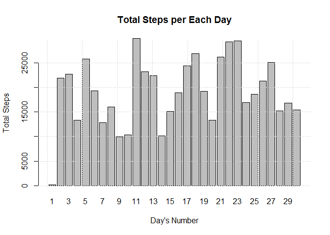
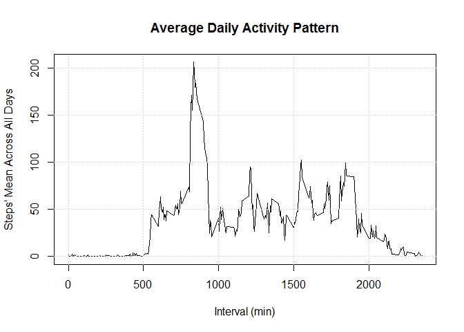
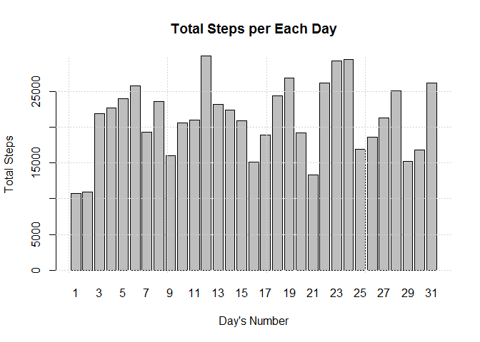
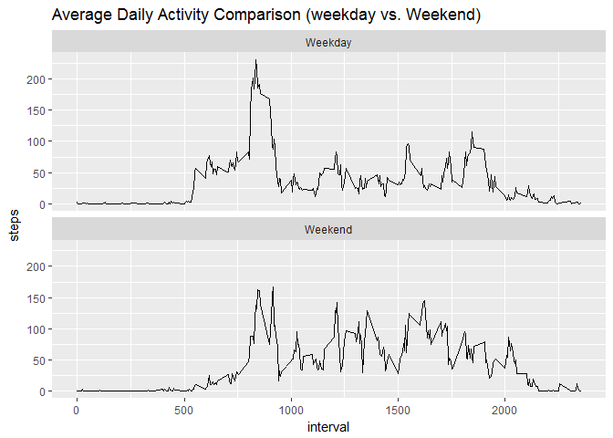

## Loading and preprocessing the data
### Loading the data

```r
code_dir = "C:/Users/Ali_D/Desktop/D_S/my_codes/Reproducible Research/w2"; setwd(code_dir)
my_ds_orig <- read.csv("activity.csv"); my_ds = my_ds_orig
```
### Processing/Transforming the data 

```r
my_ds$date = as.Date(my_ds$date)
my_ds$month = as.numeric(format(my_ds$date, format = "%m"))
my_ds$day = as.numeric(format(my_ds$date, format = "%d"))
my_ds$dayPlusMonth = my_ds$day + my_ds$month
```

## What is mean total number of steps taken per day?
### Making a histogram of the total number of steps taken each day

```r
total_steps = aggregate(formula =  steps ~ dayPlusMonth, 
                        data = my_ds, FUN = sum, na.action = na.omit)
barplot(total_steps$steps, beside = TRUE, xlab = "Day's Number", ylab = "Total Steps",
        main = "Total Steps per Each Day",
        names.arg = total_steps$dayPlusMonth - total_steps$dayPlusMonth[1] + 1)
grid(); dev.off()
```

<!-- -->

```
## null device 
##           1
```
### "Mean"" and "median" of the total number of steps taken per day

```r
steps_summary = summary(total_steps$steps);
steps_mean = as.numeric(steps_summary["Mean"]); 
names(steps_mean) = "steps_mean"; 
steps_median = as.numeric(steps_summary["Median"]); 
names(steps_median) = "steps_median"; 
as.data.frame(c(steps_mean, steps_median))
```

```
##              c(steps_mean, steps_median)
## steps_mean                      19020.27
## steps_median                    19064.50
```

## What is the average daily activity pattern?
### Making a time-series plot 

```r
mean_steps = aggregate(formula =  steps ~ interval, 
                        data = my_ds, FUN = mean, na.action = na.omit)
plot(x = mean_steps$interval, y = mean_steps$steps, type = "l",
     xlab = "Interval (min)", ylab = "Steps' Mean Across All Days", 
     main = "Average Daily Activity Pattern")
grid(); dev.off()
```

<!-- -->

```
## null device 
##           1
```
###  Maximum number of steps --> Which 5-minute interval?

```r
int_for_max_steps = mean_steps$interval[which.max(mean_steps$steps)];
names(int_for_max_steps) = "interval containing maximum steps across all the days in the dataset"
int_for_max_steps
```

```
## interval containing maximum steps across all the days in the dataset 
##                                                                  835
```

## Imputing missing values
###  Total number of missing values in the dataset (i.e. the total number of rows with NAs)

```r
logic_ds = is.na.data.frame(my_ds_orig)
and_res = logic_ds[, 1] | logic_ds[, 2] | logic_ds[, 3]
numOfNA_row = sum(and_res); names(numOfNA_row) = "Total number of missing values"; numOfNA_row
```

```
## Total number of missing values 
##                           2304
```
### Filling in all of the missing values 
### (Replacing with: the mean for that 5-minute interval)

```r
my_ds_imp = my_ds_orig; NA_index = which(logic_ds[,1])
for (idx in NA_index){
  idx_invl = my_ds_orig$interval[idx]
  newSteps = mean_steps$steps[which(idx_invl == mean_steps$interval)]
  my_ds_imp$steps[idx] = newSteps
}
```
### Creating a new dataset

```r
str(my_ds_imp)
```

```
## 'data.frame':	17568 obs. of  3 variables:
##  $ steps   : num  1.717 0.3396 0.1321 0.1509 0.0755 ...
##  $ date    : Factor w/ 61 levels "2012-10-01","2012-10-02",..: 1 1 1 1 1 1 1 1 1 1 ...
##  $ interval: int  0 5 10 15 20 25 30 35 40 45 ...
```

```r
write.csv(my_ds_imp, "activity_Imputed.csv")
```
### Making a histogram and calculating the mean and median
### (Repeating the first problem with imputed dataset)

```r
my_ds_imp$date = as.Date(my_ds_imp$date)
my_ds_imp$month = as.numeric(format(my_ds_imp$date, format = "%m"))
my_ds_imp$day = as.numeric(format(my_ds_imp$date, format = "%d"))
my_ds_imp$dayPlusMonth = my_ds_imp$day + my_ds_imp$month
total_steps2 = aggregate(formula =  steps ~ dayPlusMonth, 
                         data = my_ds_imp, FUN = sum, na.action = na.omit)
barplot(total_steps2$steps, beside = TRUE, xlab = "Day's Number", ylab = "Total Steps",
        main = "Total Steps per Each Day",
        names.arg = total_steps2$dayPlusMonth - total_steps2$dayPlusMonth[1] + 1)
grid(); dev.off()
```

<!-- -->

```
## null device 
##           1
```

```r
steps_summary2 = summary(total_steps2$steps);
steps_mean2 = as.numeric(steps_summary2["Mean"]); names(steps_mean2) = "steps_mean_imputed"; 
steps_median2 = as.numeric(steps_summary2["Median"]); names(steps_median2) = "steps_median_imputed"; 
as.data.frame(c(steps_mean2, steps_median2))
```

```
##                      c(steps_mean2, steps_median2)
## steps_mean_imputed                        21185.08
## steps_median_imputed                      21281.00
```
### Note: Imputing missing data, by replacing NAs with the mean
### of each interval, causes mean and median to increase almost 11%.

```
##              c(steps_mean, steps_median)
## steps_mean                      19020.27
## steps_median                    19064.50
```

```
##                      c(steps_mean2, steps_median2)
## steps_mean_imputed                        21185.08
## steps_median_imputed                      21281.00
```

## Are there differences in activity patterns between weekdays and weekends?
### Creating a new factor variable

```r
my_ds_imp$date = as.Date(my_ds_imp$date)
week_info  = weekdays(my_ds_imp$date)
weekend_idx = which(week_info == "Saturday" | week_info == "Sunday")
my_ds_imp$weekend = "Weekday" ; my_ds_imp$weekend[weekend_idx] = "Weekend"
my_ds_imp$weekend = as.factor(my_ds_imp$weekend)
```
### Making a panel plot

```r
mean_steps2 = aggregate(formula =  steps ~ interval + weekend, 
                       data = my_ds_imp, FUN = mean, na.action = na.omit)
require(ggplot2)
```

```
## Loading required package: ggplot2
```

```r
multi_plot <- ggplot(mean_steps2, aes(interval, steps)) + geom_line()
multi_plot + facet_wrap(~weekend, nrow = 2) + 
  ggtitle("Average Daily Activity Comparison (weekday vs. Weekend)")
```

<!-- -->
